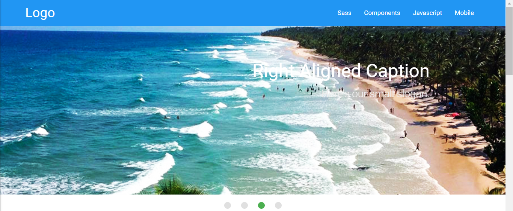
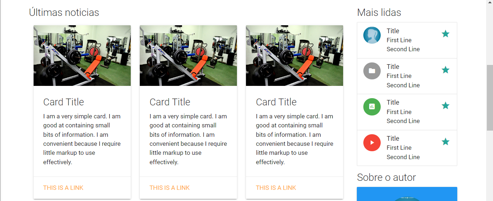
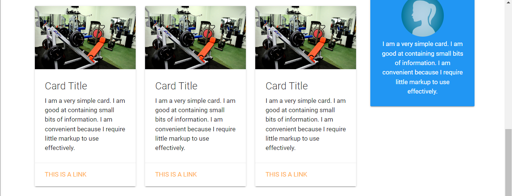
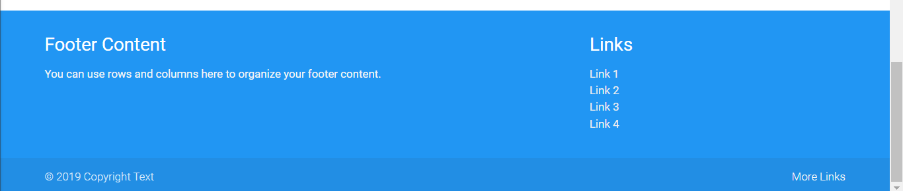

# SITE DE MATERIALIZECSS
👨‍🏫PROJETO CRIADO PARA O CURSO DE MATERIALIZECSS.

  
  
  
  

## DESCRIÇÃO:
Este projeto consiste em um site com um layout responsivo, usando o framework MaterializeCSS. Ele inclui um cabeçalho com navegação, um slider de imagens, conteúdo principal (notícias) e uma barra lateral com links adicionais e informações do autor. O rodapé contém links adicionais e informações de direitos autorais.

1. **Navegação**: A barra de navegação contém links para diferentes seções do site. No modo desktop, os links estão na parte superior. No modo mobile, você pode abrir o menu de navegação clicando no ícone de menu.

2. **Slider de Imagens**: O slider na parte superior da página exibe imagens com títulos e legendas. As imagens mudam automaticamente e você também pode navegar manualmente entre elas.

3. **Conteúdo Principal (Notícias)**: Abaixo do slider, há uma seção de notícias com várias cartas (cards) que contêm títulos, imagens e conteúdo. Cada carta também possui um link para mais informações.

4. **Barra Lateral**: A barra lateral contém links para as notícias mais lidas e informações sobre o autor do site.

5. **Rodapé**: O rodapé contém links adicionais e informações de direitos autorais.

## COMO USAR?
1. Abra o arquivo `./CODIGO/index.html` em um navegador da web para visualizar o site.

2. Explore a **Navegação**: A barra de navegação contém links para diferentes seções do site. No modo desktop, os links estão na parte superior. No modo mobile, você pode abrir o menu de navegação clicando no ícone de menu.

3. Descubra o **Slider de Imagens**: Na parte superior da página, o slider exibe imagens com títulos e legendas. As imagens mudam automaticamente e você também pode navegar manualmente entre elas.

4. Explore o **Conteúdo Principal (Notícias)**: Abaixo do slider, há uma seção de notícias com várias cartas (cards) que contêm títulos, imagens e conteúdo. Cada carta também possui um link para mais informações.

5. Verifique a **Barra Lateral**: Ela contém links para as notícias mais lidas e informações sobre o autor do site.

6. Confira o **Rodapé**: Ele contém links adicionais e informações de direitos autorais.

## PERSONALIZAÇÃO:
Você pode personalizar este projeto de várias maneiras, como alterando o conteúdo das notícias, substituindo as imagens, modificando as cores, ajustando os estilos, etc.

## CREDITOS:
- [PROJETO CRIADO PARA O CURSO DE MATERIALIZECSS](https://github.com/VILHALVA/CURSO-DE-MATERIALIZECSS)
- [PROJETO FEITO PELO VILHALVA](https://github.com/VILHALVA)
